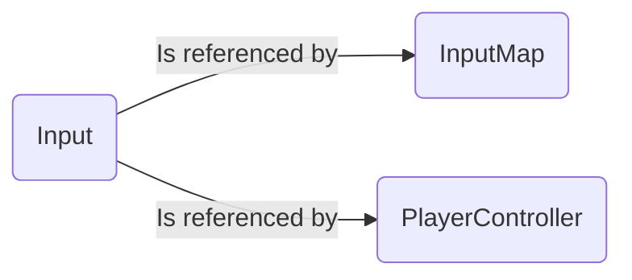
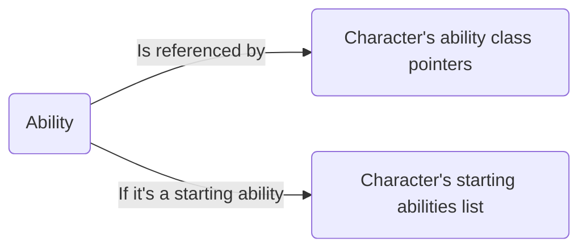
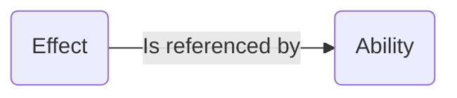

# Asset creation guidelines
## Naming guidelines
### Blueprints
Any created blueprint has to start with:

 - **BP_**

followed by the name of the blueprint. There could be more specific names that follow the *BP_* initial depending on the kind of the asset. Just to give an example, a gameplay ability will be galled *BP_GA_AbilityName*.
Some exceptions to this rule can be the files that *cannot* be created in C++ whatsoever. An example of this is animations.

Some type of blueprint that typically don't have a lot of different assets existing don't necessarily require a prefix. An example of this could be the Camera's blueprint (which still requires the *BP_* prefix at least). We also still have a layer of organization in the form of folders.
### Animations
 - **Animation Sequence**: Anim_
 - **Montage**: Montage_
 - **BlendSpace**: BS_

### Input
- **Input Action**: IA_
- **Input Map**: IMC_

### Maps/Levels
- **Level**: Map_

### Mostly Used Blueprints
- **Player Controller**: BP_PC_
- **AI Controller**: BP_AIC_
- **Game Mode**: BP_GM_

### Gameplay Ability System
- **Ability**: BP_GA_
- **Effect**: BP_GE_
- **Cue**: BP_CUE_

In C++ it's the same but without *BP_*.
## Programming guidelines
**Variable names have to be written with the capital letter**
C++ scripts have to be divided clearly between *variables* and *functions*. In each of these categories scripts have to respect the order: first public members, then protected, and then private at the end. If a class doesn't have one or more of these categories, it is *not* necessary to still write the accessibility keyword just to leave it empty, it's ok to just omit it.
A class is typically divided like this
```
class ClassName
{
	// Here is the variable space
public:
	...
protected:
	...
private:
	...
	// Here is the function space
public:
	...
protected:
	...
private:
	...
}
```
Try to always use variable names and function names that are of immediate understanding of the task they are doing or the data they are containing.
On top of this, for the longer functions or the more complicated ones for which it's not immediately obvious what they do, it's required to comment the code at the top of the function or the variable (without a specific standard, just leaving a code is fine) to briefly explain what is the purpose of the code below.
## Gameplay Ability System guidelines
Here is a little guide on how to create a skeleton of an ability, in case it's needed.
In order to create an ability we *probably* need (I'm going to do the most generic example, but there could be exceptions)

 - Input button (if character or companion)
 - Ability
 - One or more effects
 - One or more cues

In general, since the ability is activated most of the time through the **TryActivateAbilityByClass()** function, we will need a pointer to the class of the ability that we are trying to activate in the actor that is trying to activate the ability (most of the times, the main character, the companion, or an enemy)




Make sure to follow this graph, because most of the times an ability is created, the most usual result is that when the corresponding button is pressed.. Nothing happens. 99% of the time the reason is a missing reference among the ones illustrated above. After the input is responding, there will be all the unexpected bugs to correct.
In the example of an ability executed by the Main Character, this is the usual flow of an ability:

 - Player Controller has a reference to the Input Action asset, and binds the input (usually Triggered or Started) to a corresponding function to be called. The naming has to always be intuitive. Follow the already present examples.
 - The function that the Player Controller calls, **most of the times**, are just limited to tell the character to call a function that executes the ability. For example, after I press the jump button, the player controller will do GetCharacter()->JumpAbility().
 - In the character, we write the JumpAbility() function. **Most of the times**, this function is just limited to the call of the *TryActivateAbilityByClass(...)*, with the class of the Gameplay Ability as a parameter, which the character has among his variables through a class pointer.

At this point, we have to develop the ability itself.
Most of the abilities follow this template

 1. The most basic ability, it only activates and does nothing else

```
GA_AbilityName.h

class STILLHEAR_API UGA_AbilityName : public UStillHearGameplayAbility
{
	GENERATED_BODY();

public:
	// Constructor
	UGA_AbilityName();
	// Override of ActivateAbility, where we define the ability's behaviour
	virtual void ActivateAbility(const FGameplayAbilitySpecHandle Handle, const FGameplayAbilityActorInfo* ActorInfo, const FGameplayAbilityActivationInfo ActivationInfo, const FGameplayEventData* TriggerEventData) override;
}
```
```
GA_AbilityName.cpp

// Constructor
// The utility of the constructor is just to set
// every useful tag to the ability. Their goal is to set a "name"
// to the ability itself, but also to define which abilities are blocked or canceled
// by this ability, and also to define if there has to be some tags on the character
// in order to activate the ability itself, or deny its activation
UGA_AbilityName::UGA_AbilityName()
{
	// "Name of the ability" TAG 
	FGameplayTagContainer assetTags;  
	assetTags.AddTag(FGameplayTag::RequestGameplayTag(FName("Il tag va inserito qui nel formato corretto")));  
	SetAssetTags(assetTags);
	
	// This says "if this ability is active, abilities with these tags can't be activated"	
	BlockAbilitiesWithTag.AddTag(FGameplayTag::RequestGameplayTag(FName("Tag Here")));  

	// This says "if you activate this ability while other currently active abilities have these tags, those abilities are interrupted"
	CancelAbilitiesWithTag.AddTag(FGameplayTag::RequestGameplayTag(FName("Tag Here")));  
  
	// These tags are attached to the character while the ability is active
	ActivationOwnedTags.AddTag(FGameplayTag::RequestGameplayTag(FName("Here we always put AbilityTag.Active")));

	// If the ability's activation has to be blocked by tags assigned to the character, we use
	ActivationBlockedTags.AddTag(...);
	
	// If in order to activate the ability it is required that the character has some tags, we use
	ActivationRequiredTags.AddTag(...);
}

```
After establishing this, every ability can have a different behaviour that needs to be studied case by case. In general, an ability can either

 - Do something and then end immediately
 - Do something, wait for something else to happen, and when it happens do something else and then end

In the first case we just call this function after we did what we need
```
EndAbility(CurrentSpecHandle, CurrentActorInfo, CurrentActivationInfo, false, false);
```

or, if we call the EndAbility directly in the ActivateAbility function, we can just call 
```
EndAbility(Handle, ActorInfo, ActivationInfo, false, false);
```
In the second case it's more complicated and depending what we need, the code is different. The most common things abilities do are:

 - WaitGameplayEvent
 - PlayMontageAndWait

This guide is getting long, so if you need to do one of these things, or do some other useful tasks such as *sending a Gameplay Event* or *activating and removing a Gameplay Effect*, you can take example or copy and paste the already existing code snippets in the project, or just refer to me and I will explain verbally. I will eventually make this guide more complete with time if I can.

 

