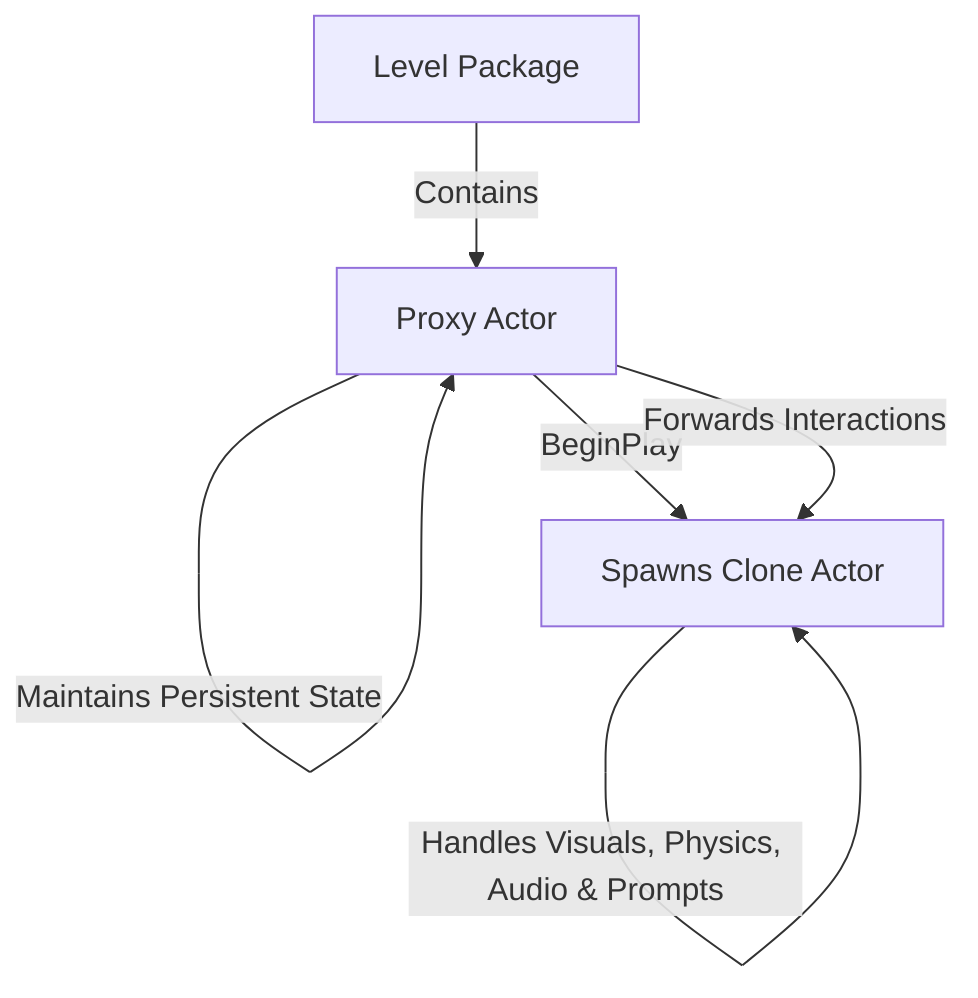
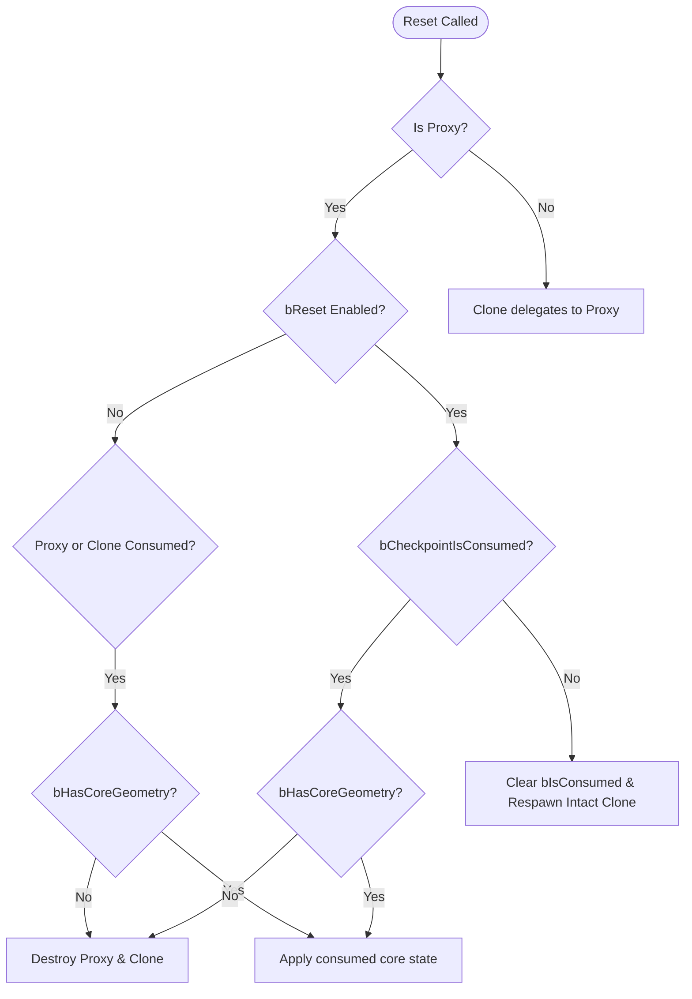

# Technical Reference: Save & Reset System for Interactables

This document details the architecture, serialization mechanisms, and resetting logic for interactable objects (specifically `ChaosResonanceObj` such as crystals, stalactites, and falling rocks) in the **StillHear** codebase.

---

## 1. Core Architecture

The saving and loading architecture revolves around three main components:

1. **`USaveSubsystem` (GameInstance Subsystem)**:
   - Captures the game state on-demand (checkpoints) or dynamically (level streaming).
   - Manages reading/writing from/to disk slots using `USaveGameObject`.
   - Restores serialized state back onto levels when they load.
2. **`USaveIdComponent`**:
   - Generates stable, deterministic GUIDs for actors based on their level key and name:
     `FGuid::NewDeterministicGuid(LevelKey.ToString() + "." + ActorName)`
   - Allows the subsystem to map saved data back to specific actor instances across different play sessions, builds, or streaming bounds.
   - Dynamically spawned clone actors are tagged with `DynamicallySpawned` and return an invalid GUID, preventing duplicate serialization.
3. **`ISavable` / `IRestorable` (Interfaces)**:
   - Provide standard lifecycle callbacks (`OnPreSave`, `OnPostLoad`, `Reset`) executed before writing or after restoring actor properties.

---

## 2. Geometry Collection Streaming Workaround

Unreal Engine 5 has a known limitation/bug regarding physics simulation and state recovery on streamed-in `GeometryCollection` components. To bypass this, `AChaosResonanceObj` implements a **Proxy/Clone** design pattern:

- **Proxy Actor**: Placed directly in the level map. It has a stable name and GUID, making it the sole authority for serialization. On load, it hides itself, disables its collision, and spawns the clone.
- **Clone Actor**: Spawned dynamically at runtime. It handles all gameplay logic, prompts, Niagaras, audio, and physics simulations. It forwards state changes (like consumption) back to the proxy.

---

## 3. State Persistence and Synchronization

The persistence logic separates the current runtime state from the checkpoint snapshot to support both level streaming and player death resets.

### State Variables
- **`bIsConsumed` (SaveGame)**:
  - Tracks whether the object is currently destroyed/interacted with.
  - Set to `true` on the clone upon interaction, which instantly propagates it to the proxy (`MyProxy->bIsConsumed = true`).
  - Saved during level streaming transitions, ensuring the object remains in its correct state when players walk back and forth.
- **`bCheckpointIsConsumed` (SaveGame)**:
  - Tracks the state of the object at the last crossed checkpoint.
  - Set during `SaveCheckpointState()` when the `SceneManager` broadcasts `OnCheckpointSnapshot`.
  - Used during world resets (player death) to determine if the object should be restored or remain destroyed.

### Life Cycle Sync Workflows

#### A. Level Stream-Out (Unloading)
1. `USaveSubsystem::OnLevelRemovedFromWorld` fires.
2. `SaveLevelInto()` is called, triggering `OnPreSave()` on actors.
3. The proxy is serialized. Since `bIsConsumed` is marked `SaveGame`, its latest runtime state is written to `CurrentSave`.

#### B. Level Stream-In (Loading)
1. `USaveSubsystem::OnLevelAddedToWorld` fires.
2. `ApplyLevel()` executes, deserializing proxy data from `CurrentSave`.
3. `OnPostLoad_Implementation()` runs on the proxy:
   - If `bIsConsumed` (or checkpoint consumed) is `true`:
     - If the object has no core geometry (`bHasCoreGeometry == false`), the proxy and any clone are destroyed.
     - If it has core geometry, `ApplyConsumedState()` is called to hide debris, disable overlaps, keep the core visible, and fast-forward the Chaos cache.
   - If `bIsConsumed` is `false`, `Reset()` runs to ensure it is in its intact, interactable state.

---

## 4. Reset & Death Flow

When the player dies and the world resets, `ASceneManager` broadcasts `OnRequestWorldReset`. All registered actors call `Reset()`:

---

## 5. Core Geometry Preservation (`bHasCoreGeometry`)

Some objects (like crystals) have persistent core stubs that should remain in the level after the rest of the crystal is destroyed, while others (like falling rocks) should disappear entirely.

1. **Detection**: On `BeginPlay()`, the actor checks if its `CoreGeometryCollectionComponent` has a valid rest collection, storing the result in `bHasCoreGeometry`.
2. **Transitioning into Consumed State**:
   If the object is consumed but `bHasCoreGeometry` is `true`, `ApplyConsumedState()` is executed:
   - `bIsConsumed = true`
   - `DebrisGeometryCollectionComponent` is hidden and disabled.
   - `CoreGeometryCollectionComponent` is kept visible with collision enabled.
   - `SetStartTime(999.0f)` and `TriggerAll()` are called on the Chaos cache player to force the simulation to its final state instantly.
   - Proximity overlays, UI prompts, and highlights are disabled.
