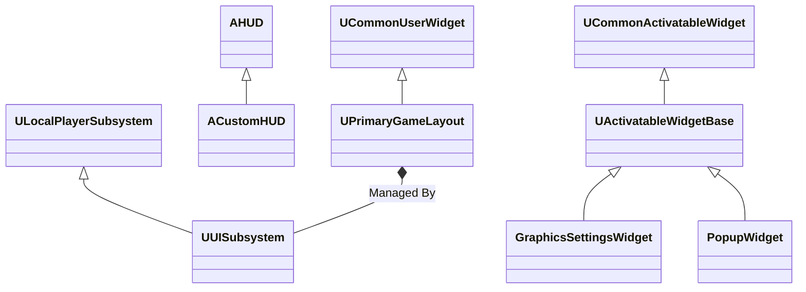
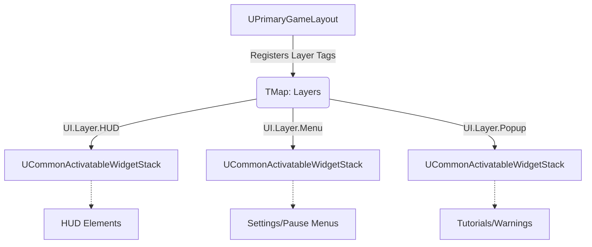

# UI System Architecture (TPP_02 Project)

The User Interface (UI) system in this project is heavily based on Epic Games' **CommonUI** architecture. It is designed to foster a modular, stack-based design with excellent, out-of-the-box support for gamepad navigation and input routing.

## 1. System Overview & Hierarchy

The following diagram illustrates the relationship between the core classes of the UI system:

### `ACustomHUD` (`CustomHUD.h / .cpp`)
This class replaces the classic Unreal Engine HUD, delegating almost all visual rendering to a Layout system. Its main purpose is to act as an entry point when a level is loaded:
- During `BeginPlay()`, it instantiates the `PrimaryLayoutClass` (a Blueprint derived from `UPrimaryGameLayout`).
- It injects this layout into the game world, making it globally accessible before delegating the actual rendering of menus to it.

### `UUISubsystem` (`UISubsystem.h`)
This is a `ULocalPlayerSubsystem`, meaning it exists and persists for each local player. It acts as the central, global API for the user interface.
- **Reference Management**: It holds a Transient reference to the `RootLayout` (`UPrimaryGameLayout`).
- **Layer Management**: It exposes Blueprint-accessible functions to push or remove widgets into specific stacks using *Gameplay Tags* (e.g., `PushWidgetToLayer` and `ClearLayer`).
- **Global Events**: It contains the `OnUILayoutReady` event dispatcher to notify other game systems (like the PlayerController or GameMode) when the base UI is ready to accept commands.

*(Note: There is also a `UUIManagerSubsystem` implementing a more basic linear stack via `PushScreen`/`PopScreen`. This might be used for specific parallel logic or could be an older layer not fully deprecated yet).*

## 2. The Main Canvas: `UPrimaryGameLayout`

`UPrimaryGameLayout` (derived from `UCommonUserWidget`) is the actual "root canvas" added to the screen.

- Instead of spawning widgets randomly on the screen, it manages well-defined **Layers** (HUD, Menu, Popup, etc.).
- It uses a map `TMap<FGameplayTag, UCommonActivatableWidgetStack*> Layers` to connect a conceptual Tag (e.g., `UI.Layer.Menu`) to its physical container on the screen (`UCommonActivatableWidgetStack`).
- The `PushWidgetToLayer` function forwards the widget creation request to the correct stack. This ensures that, for example, a `Popup` is always rendered on top of the HUD or underlying menus without z-order conflicts.

## 3. Windows and Menus: `UActivatableWidgetBase`

Any main menu, options panel, or complex popup derives from `UActivatableWidgetBase` (which extends the Activatable Widget system). This class abstracts a lot of repetitive logic:
- **Automatic Input Configuration**: Using the `InputConfig` variable (based on a custom Enum) and `GameMouseCaptureMode`, it enforces the correct mouse and keyboard behavior every time the menu is opened (by overriding `GetDesiredInputConfig()`).
- **Universal "Back" Action**: It has a `BackInputAction` property (based on a Data Table). Through `HandleBackActionBinding()`, it automatically intercepts the "Back" key press (e.g., ESC key or B button on a Gamepad) to trigger menu closure in a standardized way.
- **Game State (UI State)**: It uses `FGameplayTag UIStateTag` to allow the system to implicitly "know" what state the player is in at the interface level.
- **Event Routing**: It introduces the `RouteAction(FGameplayTag, UButtonBase*)` method, designed to bubble up actions from small buttons to the main menu manager in an elegant and decoupled way.

## 4. UI Elements

The `Elements` directory contains the visual building blocks. These specialize standard components to provide uniform aesthetics, audio feedback, and states (Hover/Focus) throughout the project:
- **`ButtonBase`**: An extended button, with specialized derivations like `PopupButtonBase`, `DeleteSlotButtonBase`, and `SaveSlotButtonBase`.
- **`RotatorBase` / `SliderBase`**: Essential interaction elements in Options menus for cycling through values (e.g., Texture Quality, FOV) and fully usable with both a mouse and a controller D-Pad.
- **`TabWidgetBase`**: The fundamental component for navigating between tabs (e.g., Video, Audio, Gameplay).

## 5. Concrete Implementations (Widgets / Settings)

The actual "screens" reside in the `Widgets` and `Settings` subfolders (derived from the bases mentioned above):
- **Settings**: `GraphicsSettingsWidget`, `AudioSettingsWidget`, and specific upscaling modules like `DLSSSettingsWidget` and `FSRSettingsWidget`. 
- **Alerts and Helpers**: `PopupWidget`, `TutorialPopupWidget`.
- **Utility and Debugging**: `PSOLoadingWidget` (likely used at startup for shader pre-compilation), `GraphicsDebugWidget`.
- **Interfaces**: `UIWidgetInterface` is used to guarantee communication between various panels independently.

---

## 6. Example Flow: Opening a Menu

Here is a sequence diagram showing what happens behind the scenes when a player opens a UI menu (like the Pause Menu):

```mermaid
sequenceDiagram
    participant Player as Player/Input
    participant Subsystem as UUISubsystem
    participant Layout as UPrimaryGameLayout
    participant Stack as Menu Stack (UI.Layer.Menu)
    participant Menu as PauseMenu (UActivatableWidgetBase)

    Player->>Subsystem: Press "Pause" -> PushWidgetToLayer()
    Subsystem->>Layout: Route Push Request
    Layout->>Stack: Add Widget to Stack
    Stack->>Menu: Construct & Add to Viewport
    
    rect rgb(40, 40, 50)
        Note over Menu: Widget Activation Phase
        Menu->>Menu: NativeOnActivated()
        Menu->>Player: Override Input Mode (e.g. Menu Only)
        Menu->>Menu: Listen for "BackInputAction" (ESC/B Button)
    end
    
    Player->>Menu: Press "ESC" (Back Action)
    Menu->>Menu: DeactivateWidget()
    Menu->>Stack: Remove from Stack
    Menu->>Player: Restore Game Input Mode
```

